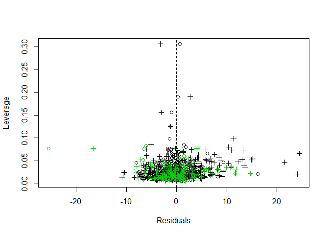

nnBostonHousing
================
Ingrid Baade
March 13, 2018

I wanted to try using keras from within R, having used keras in Python in the Coursera Deep Learning Specialization. The sequence model I'm going to build is for the Boston Housing data. It has 506 rows and 14 columns; 13 predictors and Y = house price, so not much data. The data is from the 1970 census. The 506 rows are broken into a training set (404 samples) and a test set (102 samples). This runs a neural network model on the divison of the data into training and test sets.

``` r
# devtools::install_github("rstudio/keras")
# install_keras()
library(keras)
```

``` r
boston <- dataset_boston_housing()
x_train <- scale(boston$train$x)
y_train <- boston$train$y

x_test <- scale(boston$test$x, attr(x_train, "scaled:center"), attr(x_train, "scaled:scale"))
y_test <- boston$test$y

model <- keras_model_sequential()
model %>% 
  layer_dense(units = 50, activation = NULL, input_shape = c(13)) %>% 
  layer_activation(activation='relu') %>%
#  layer_dropout(0.3) %>%             worked better without dropout; not enough data  
  layer_dense(units = 1) 

summary(model)
```

    ## ___________________________________________________________________________
    ## Layer (type)                     Output Shape                  Param #     
    ## ===========================================================================
    ## dense_1 (Dense)                  (None, 50)                    700         
    ## ___________________________________________________________________________
    ## activation_1 (Activation)        (None, 50)                    0           
    ## ___________________________________________________________________________
    ## dense_2 (Dense)                  (None, 1)                     51          
    ## ===========================================================================
    ## Total params: 751
    ## Trainable params: 751
    ## Non-trainable params: 0
    ## ___________________________________________________________________________

``` r
model %>% compile(
  loss = loss_mean_squared_error,
  optimizer = optimizer_adam()
)

history <- model %>% fit(
  x_train, y_train, 
  epochs = 500, batch_size = 32, 
  validation_split = 0.1, verbose=0)

trainres<-as.matrix(y_train) - predict(model,x_train)
testres<- as.matrix(y_test) - predict(model,x_test)
```

Fit ols model and plot residuals.

``` r
lmfit <-lm(y_train ~ x_train)
lmtrainres<-as.matrix(y_train) - (x_train%*%lmfit$coefficients[2:14] + lmfit$coefficients[1])
lmtestres <-as.matrix(y_test) - (x_test%*%lmfit$coefficients[2:14] + lmfit$coefficients[1])

plot(1:404,trainres, xlim=c(0,506), ylim=c(min(c(trainres,testres, lmtrainres, lmtestres)),max(c(trainres,testres,lmtrainres, lmtestres))),ylab="Residuals", xlab="Index")
points(405:506, testres,col=3)
points(1:404, lmtrainres, pch=3)
points(405:506, lmtestres, pch=3, col=3)
```


Plot of residuals from training data in black and test data in green. Neural net model is circles and linear model is crosses.

Inspection of y variable against each explanatory variable shows an outlier in the test group for variable 6. In this plot, the training set is in black and the test set is in green.

``` r
plot(x_train[,6],y_train, xlab="X[,6]", ylab="Y", pch=5)
points(x_test[,6],y_test,col=3,pch=5)
```


Plot of Y versus explanatory variable 6. Black is training data, green is test set data.

A quick scan of the residuals and leverage is always worthwhile. I've used the H matrix from all the data. The outlying x value for variable 6 (generating the large residual) has somewhat high leverage but not the worst.

``` r
X<-cbind(1,rbind(x_train, x_test))
H<-X%*%(solve(t(X)%*%X)%*%t(X))

minlim<-min(lmtrainres, trainres, lmtestres, testres)
maxlim<-max(lmtrainres, trainres, lmtestres, testres)
plot(lmtrainres,diag(H[1:404, 1:404]), xlim=c(minlim,maxlim), pch=3, xlab="Residuals", ylab="Leverage")
points(trainres,diag(H[1:404, 1:404]))
abline(v=0,lty=2)
points(testres,diag(H[405:506, 405:506]), col=3)
points(lmtestres,diag(H[405:506, 405:506]), pch=3, col=3)
```



Plot of residuals versus leverage from training data in black and test data in green. Neural net model is circles and linear model is crosses.

How can we look at the test set and decide if we have high leverage cases that might be "dissimilar to the training data"?
