nnBostonHousing
================
Ingrid Baade
March 13, 2018

I wanted to try using keras from within R, having used keras in Python in the Coursera Deep Learning Specialization. The sequence model I'm going to build is for the Boston Housing data. It has 506 rows and 14 columns; 13 predictors and Y = house price. The data is from the 1970 census. The 506 rows are broken into a training set (404 samples) and a test set (102 samples).

``` r
# devtools::install_github("rstudio/keras")
# install_keras()
library(keras)
```

``` r
set.seed(1)
numit <- 10
train_loss<-rep(0,numit)
test_loss<-rep(0,numit)

boston <- dataset_boston_housing()
x_train <- scale(boston$train$x)
y_train <- boston$train$y

x_test <- scale(boston$test$x, attr(x_train, "scaled:center"), attr(x_train, "scaled:scale"))
y_test <- boston$test$y

all_boston_x<-rbind(x_train, x_test)
all_boston_y<-c(y_train, y_test)

model <- keras_model_sequential()
model %>% 
  layer_dense(units = 50, activation = NULL, input_shape = c(13)) %>% 
  layer_activation(activation='relu') %>%
  layer_dropout(0.3) %>%
  layer_dense(units = 1) 

summary(model)
```

    ## ___________________________________________________________________________
    ## Layer (type)                     Output Shape                  Param #     
    ## ===========================================================================
    ## dense_1 (Dense)                  (None, 50)                    700         
    ## ___________________________________________________________________________
    ## activation_1 (Activation)        (None, 50)                    0           
    ## ___________________________________________________________________________
    ## dropout_1 (Dropout)              (None, 50)                    0           
    ## ___________________________________________________________________________
    ## dense_2 (Dense)                  (None, 1)                     51          
    ## ===========================================================================
    ## Total params: 751
    ## Trainable params: 751
    ## Non-trainable params: 0
    ## ___________________________________________________________________________

``` r
model %>% compile(
  loss = loss_mean_squared_error,
  optimizer = optimizer_adam()
)

history <- model %>% fit(
  x_train, y_train, 
  epochs = 300, batch_size = 32, 
  validation_split = 0.0, verbose=0)

trainRes<-predict(model,x_train)-as.matrix(y_train)
testRes<-predict(model,x_test)-as.matrix(y_test)
plot(1:404,trainRes, xlim=c(0,506), ylim=c(min(c(trainRes,testRes)),max(c(trainRes,testRes))),ylab="Residuals", xlab="Index")
points(405:506, testRes,col=2)
```

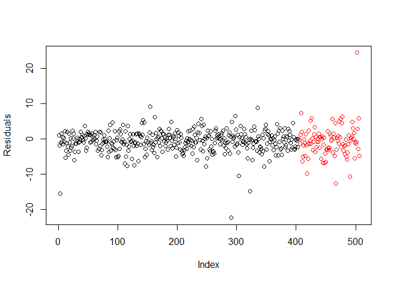

``` r
for (i in 1:numit){
    
this_sample<-sample(1:506,102, replace=F)
train_index<-which(!(1:506 %in% this_sample))
test_index<-which(1:506 %in% this_sample)

train_x <- all_boston_x[train_index,]
train_y <- all_boston_y[train_index]

test_x <- all_boston_x[test_index,]
test_y <- all_boston_y[test_index]

x_train <- scale(train_x)
y_train <- train_y
# The test values should be scaled with mu and sd from training data, NOT "x_test <- scale(test_x)"
x_test <- scale(test_x, attr(x_train, "scaled:center"), attr(x_train, "scaled:scale"))
y_test <- test_y

model <- keras_model_sequential()
model %>% 
  layer_dense(units = 50, activation = NULL, input_shape = c(13)) %>% 
  layer_activation(activation='relu') %>%
  layer_dropout(0.3) %>%
  layer_dense(units = 1) 

#summary(model)

model %>% compile(
  loss = loss_mean_squared_error,
  optimizer = optimizer_adam()
)

history <- model %>% fit(
  x_train, y_train, 
  epochs = 300, batch_size = 32, 
  validation_split = 0.0, verbose=0)

#plot(history)

test_loss[i] <- model %>% evaluate(x=x_test, y=y_test) # This returns the loss.
train_loss[i] <- model %>% evaluate(x=x_train, y=y_train)

trainRes<-predict(model,x_train)-as.matrix(y_train)
testRes<-predict(model,x_test)-as.matrix(y_test)
plot(1:404,trainRes, xlim=c(0,506), ylim=c(min(c(trainRes,testRes)),max(c(trainRes,testRes))),ylab="Residuals", xlab="Index")
points(405:506, testRes,col=2)

}
```

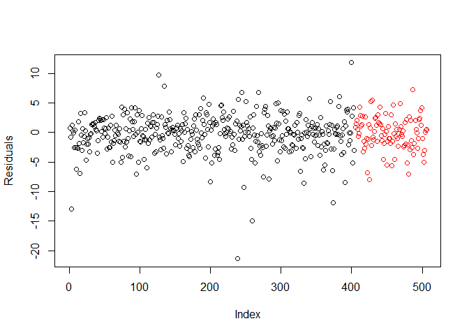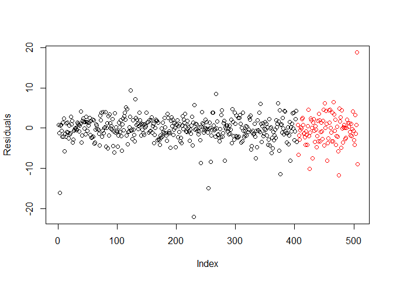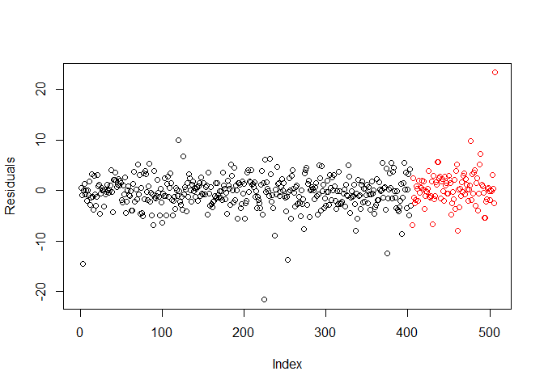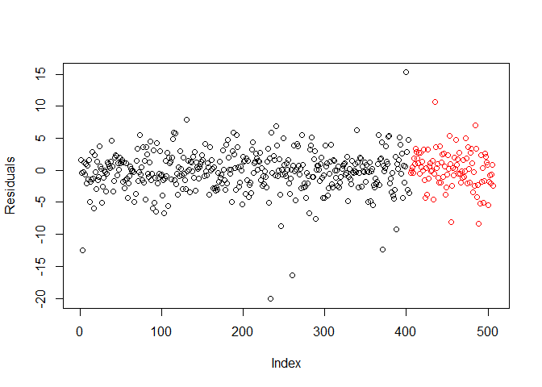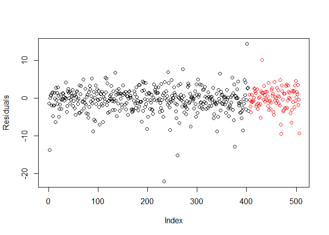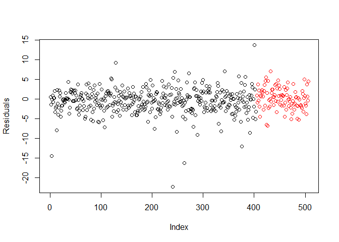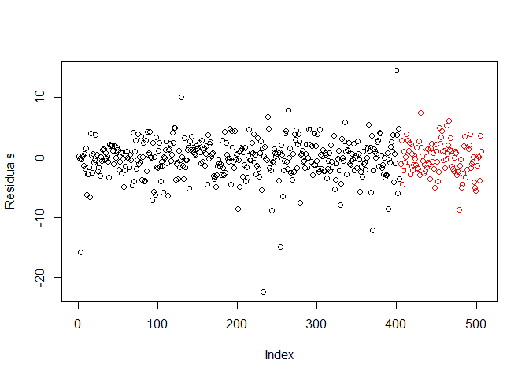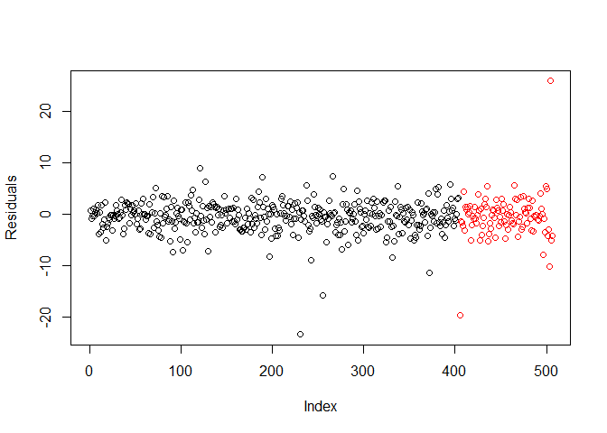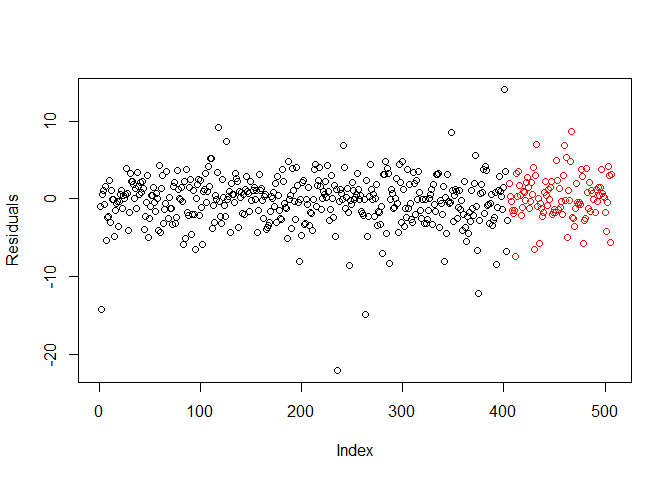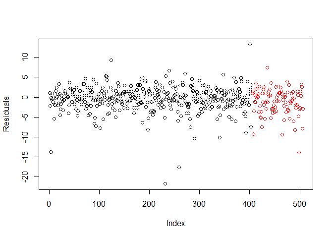
