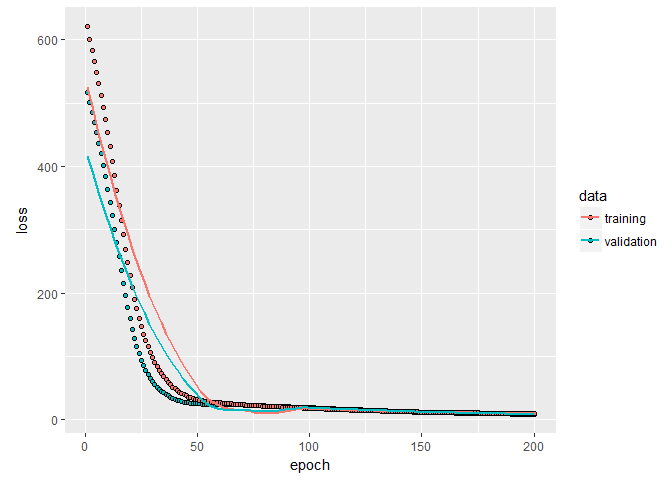
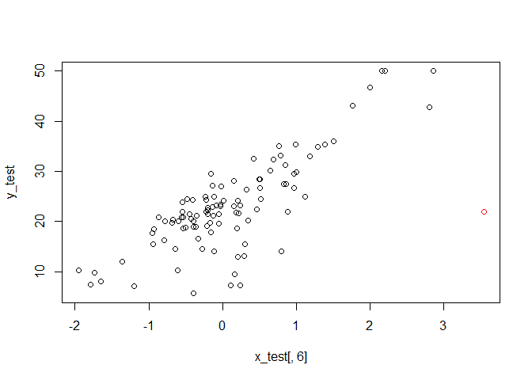
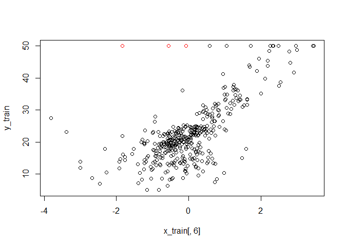
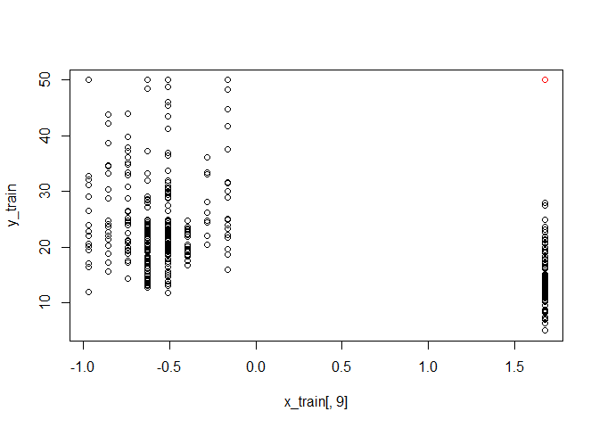
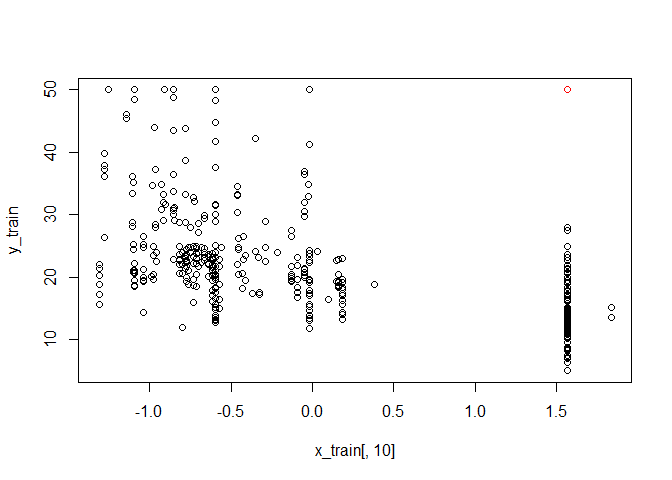
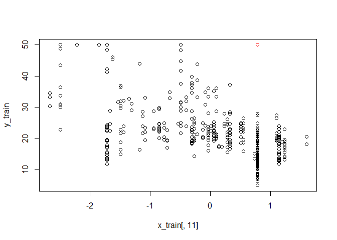
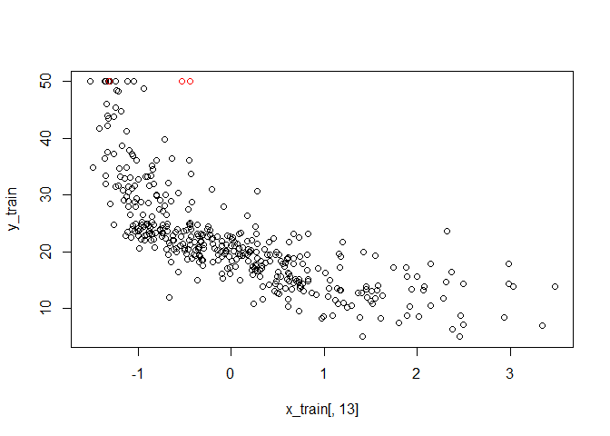
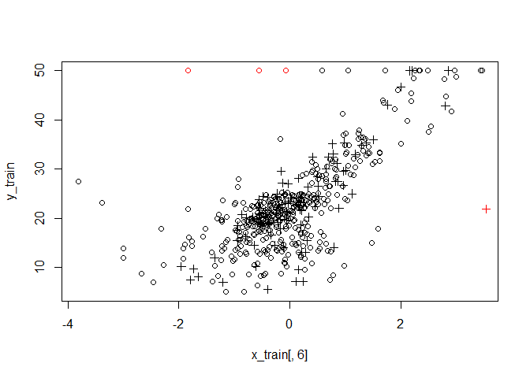

  


I wanted to try using keras from within R, having used keras in Python in the Coursera Deep Learning Specialization. The recurrent neural net (RNN) I'm going to build is for the Boston Housing data. It has 506 rows and 14 columns; 13 predictors and Y = house price. The data is from the 1970 census. The 506 rows are broken into a training set (404 samples) and a test set (102 samples).

I tried kerasR first. I got a message saying I needed to "install_keras()"" to get the TensorFlow backend; ?? is this what it means that kerasR does not have full functionality? Must be.


```r
# devtools::install_github("rstudio/keras")
# install_keras()
```

I had to install anaconda for install_keras() to work. Anaconda looks to have an introductory tute on line... to look at one day. I also need to look in the install_keras() documentation to see how to take advantage of NVidia GPUs.


```r
library(keras)
```

This code is from the kerasR example for the Boston Housing data. I'm rewriting this in keras.

mod <- Sequential()

mod$add(Dense(units = 50, input_shape = 13))

mod$add(Activation("relu"))

mod$add(Dense(units = 1))

keras_compile(mod,  loss = 'mse', optimizer = RMSprop())

boston <- load_boston_housing()

X_train <- scale(boston$X_train)

Y_train <- boston$Y_train

X_test <- scale(boston$X_test)

Y_test <- boston$Y_test

keras_fit(mod, X_train, Y_train,
          batch_size = 32, epochs = 200,
          verbose = 1, validation_split = 0.1)

output

pred <- keras_predict(mod, normalize(X_test))

sd(as.numeric(pred) - Y_test) / sd(Y_test)

[1] 0.7692395

I got the format for the keras commands from the mnist dataset example on the keras.rstudio.com page. In the dense layer, the default is: activation is NULL, which is linear.


```r
boston <- dataset_boston_housing()
x_train <- scale(boston$train$x)
y_train <- boston$train$y
# The test values should be scaled with mu and sd from training data, NOT "x_test <- scale(boston$test$x)"
x_test <- scale(boston$test$x, attr(x_train, "scaled:center"), attr(x_train, "scaled:scale"))
y_test <- boston$test$y

model <- keras_model_sequential()
model %>% 
  layer_dense(units = 50, activation = NULL, input_shape = c(13)) %>% 
  layer_activation(activation='relu') %>%
  layer_dense(units = 1) 

summary(model)
```

```
## ___________________________________________________________________________
## Layer (type)                     Output Shape                  Param #     
## ===========================================================================
## dense_1 (Dense)                  (None, 50)                    700         
## ___________________________________________________________________________
## activation_1 (Activation)        (None, 50)                    0           
## ___________________________________________________________________________
## dense_2 (Dense)                  (None, 1)                     51          
## ===========================================================================
## Total params: 751
## Trainable params: 751
## Non-trainable params: 0
## ___________________________________________________________________________
```

```r
# Andrew Ng says the Adam optimizer is the best. 
model %>% compile(
  loss = loss_mean_squared_error,
  #  optimizer = optimizer_rmsprop()
  optimizer = optimizer_adam()
)

history <- model %>% fit(
  x_train, y_train, 
  epochs = 200, batch_size = 32, 
  validation_split = 0.1, verbose=0
)

plot(history)
```

<!-- -->

```r
model %>% evaluate(x=x_test, y=y_test) # This returns the loss.
```

```
##     loss 
## 19.87223
```

```r
#model %>% predict(x_test) this outputs fitted values
```
I decidecd to have a look at the test set residuals from fitting the neural net and from a least squares fit.


```r
nnres<-(predict(model,x_test)-as.matrix(y_test))

lmfit<-lm(y_train ~ x_train)
lmres<-(x_test%*%lmfit$coefficients[2:14] + lmfit$coefficients[1])-as.matrix(y_test)

# Compare the residual sums of squares from the test data:

print("Neural Net RSS/102 =  Loss =")
```

```
## [1] "Neural Net RSS/102 =  Loss ="
```

```r
print(sum(nnres^2)/102)
```

```
## [1] 19.87223
```

```r
print("Linear Model RSS/102 = ")
```

```
## [1] "Linear Model RSS/102 = "
```

```r
print(sum(lmres^2)/102)
```

```
## [1] 23.1956
```
I need to fix that outputting. 

So the neural net with its 751 parameters does better than the linear model on the test data. This is a small suggestion that my code could be working. I'd just like to see how the residuals from training compare between the two models.


```r
nntrainres<-(predict(model,x_train)-as.matrix(y_train))

lmtrainres<-(x_train%*%lmfit$coefficients[2:14] + lmfit$coefficients[1])-as.matrix(y_train)

#plot training residuals from both methods and tests residuals from both methods.

par(mfrow=c(1,2))
plot(lmtrainres, main="", ylab="Residuals from training set", ylim=c(-25,25))
points(nntrainres,col=2)
legend("top", col=c(1,2), legend=c("lm training", "nn training"), pch=1)
abline(h=0, lty=2)

plot(lmres, main="", ylab="Residuals from test set", ylim=c(-25,25))
points(nnres,col=2)
legend("top", col=c(1,2), legend=c("lm test", "nn test"), pch=1)
abline(h=0, lty=2)
```

<!-- -->

Plotting y against some of the predictors looks like y could not be bigger than 50. Which residuals correspond to these observations? 

This is an example dataset but I can't resist investigating the outliers. First look at the one large nn test residual.


```r
which(nnres>=20)
```

```
## [1] 98
```

```r
# it is number 98
# maybe it's y value is 50?
y_test[98]
```

```
## [1] 21.9
```

```r
# nope this y value is 21.9

#plot(x_test[,1],y_test)
#points(x_test[98,1],y_test[98],col=2)
#plot(x_test[,2],y_test)
#points(x_test[98,2],y_test[98],col=2)
#plot(x_test[,3],y_test)
#points(x_test[98,3],y_test[98],col=2)
#plot(x_test[,4],y_test)
#points(x_test[98,4],y_test[98],col=2)
#plot(x_test[,5],y_test)
#points(x_test[98,5],y_test[98],col=2)
plot(x_test[,6],y_test)
points(x_test[98,6],y_test[98],col=2)
```

<!-- -->

```r
#plot(x_test[,7],y_test)
#points(x_test[98,7],y_test[98],col=2)
#plot(x_test[,8],y_test)
#points(x_test[98,8],y_test[98],col=2)
#plot(x_test[,9],y_test)
#points(x_test[98,9],y_test[98],col=2)
#plot(x_test[,10],y_test)
#points(x_test[98,10],y_test[98],col=2)
#plot(x_test[,11],y_test)
#points(x_test[98,11],y_test[98],col=2)
#plot(x_test[,12],y_test)
#points(x_test[98,12],y_test[98],col=2)
#plot(x_test[,13],y_test)
#points(x_test[98,13],y_test[98],col=2)
```
So that is an x value that needs checking. 

What are the three large training set linear model residuals? One is also a large nn residual.

```r
which(lmtrainres <= -20)
```

```
## [1]   3 291 322
```

```r
which(nntrainres <= -20)
```

```
## [1] 291
```

```r
# the lm residuals that are big are 3, 291 and 322. 
# the nn residual that is also big is 291.

# Are any of these associated with y = 50?

y_train[which(lmtrainres <= -20)]
```

```
## [1] 50 50 50
```
Yep, all three associated with the y=50 issue. Just for fun, plot the predictors against the y training values.


```r
#plot(x_train[,1],y_train)
#points(x_train[c(3,291,322),1],y_train[c(3,291,322)],col=2)
#plot(x_train[,2],y_train)
#points(x_train[c(3,291,322),2],y_train[c(3,291,322)],col=2)
#plot(x_train[,3],y_train)
#points(x_train[c(3,291,322),3],y_train[c(3,291,322)],col=2)
#plot(x_train[,4],y_train)
#points(x_train[c(3,291,322),4],y_train[c(3,291,322)],col=2)
#plot(x_train[,5],y_train)
#points(x_train[c(3,291,322),5],y_train[c(3,291,322)],col=2)
plot(x_train[,6],y_train)
points(x_train[c(3,291,322),6],y_train[c(3,291,322)],col=2)
```

<!-- -->

```r
#plot(x_train[,7],y_train)
#points(x_train[c(3,291,322),7],y_train[c(3,291,322)],col=2)
#plot(x_train[,8],y_train)
#points(x_train[c(3,291,322),8],y_train[c(3,291,322)],col=2)
plot(x_train[,9],y_train)
points(x_train[c(3,291,322),9],y_train[c(3,291,322)],col=2)
```

<!-- -->

```r
plot(x_train[,10],y_train)
points(x_train[c(3,291,322),10],y_train[c(3,291,322)],col=2)
```

<!-- -->

```r
plot(x_train[,11],y_train)
points(x_train[c(3,291,322),11],y_train[c(3,291,322)],col=2)
```

<!-- -->

```r
#plot(x_train[,12],y_train)
#points(x_train[c(3,291,322),12],y_train[c(3,291,322)],col=2)
plot(x_train[,13],y_train)
points(x_train[c(3,291,322),13],y_train[c(3,291,322)],col=2)
```

<!-- -->
The y values are outlying in plots 6, 9, 10 and 11, and two of the three points are unusual in 13 as well.

Plot variable 6 for the training data and the test data. Circles are training data and Xs are test data. You can see the training data outliers are pulling both models away from the test set outlier, but as residuals after model fitting, the nn residual is larger than the lm model residual because the nn model is overfitting. 


```r
plot(x_train[,6], y_train)
points(x_test[,6],y_test, pch=3)
points(x_test[98,6],y_test[98], pch=3, col=2)
points(x_train[c(3,291,322),6],y_train[c(3,291,322)], col=2)
```

<!-- -->

And lastly, what are the RSSs for the training data?


```r
print(sum(lmtrainres^2)/404)
```

```
## [1] 22.0048
```

```r
print(sum(lmres^2)/102)
```

```
## [1] 23.1956
```

```r
print(sum(nntrainres^2)/404)
```

```
## [1] 9.444553
```

```r
print(sum(nnres^2)/102)
```

```
## [1] 19.87223
```
You'd have to say the nn model is overfitting based on these numbers, whereas the lm model is not. 

I've done everything back to front for a statistician. 

This is how I'll do it when I look at this data again:

1. Plot the training and test y_values against each of the 13 parameters. This can be done with thirteen parameters, but coud be problematic with 1000s of covariates. Deal with anything that looks dodge right from the start.

2. Have a look at the updated dataset and see if they sorted out some of the outliers I can see. I'll laugh if those 50s are actually "99"s that someone decided should be 50.

3. Have a smaller holdout set.

4. Have a randomly chosen holdout set. 

5. Use some regularisation. Put in a dropout layer or two probably.


